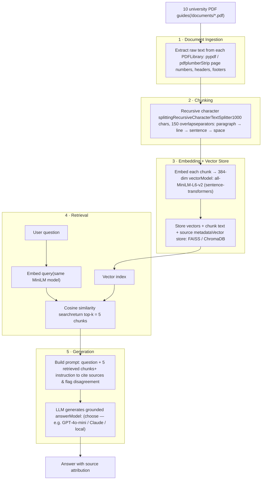

# Project 1 Planning: The Unofficial Guide

> Write this document before you write any pipeline code.
> Your spec and architecture diagram are what you'll use to direct AI tools (Claude, Copilot, etc.) to generate your implementation — the more specific they are, the more useful the generated code will be.
> Update the Retrieval Approach and Chunking Strategy sections if you change your approach during implementation.
> Update this file before starting any stretch features.

---

## Domain

I chose the domain of resumes and cover letters. Although there are many resources available, the information is often scattered across university guides and websites, making it difficult to navigate. My idea is to build a RAG system that combines these sources and provides users with clear answers and guidance while creating or improving their resumes and cover letters.

---

## Documents

<!-- List your specific sources: URLs, subreddit names, forum threads, or file descriptions.
     Aim for at least 10 sources that together cover different subtopics or perspectives within your domain. -->

| # | Source | Description | URL or location |
|---|--------|-------------|-----------------|
| 1 | Document | resume guide from harvard|"\documents\Resume-Guide-harvard.pdf" |
| 2 | Document | resume guide from CMU |"\documents\Resume-Guide-cmu.pdf" |
| 3 | Document | resume guide from GA Tech|"\documents\Resume-Guide-gatech.pdf" |
| 4 | Document | resume guide from UCDavis|"\documents\Resume-Guide-ucdavis.pdf" |
| 5 | Document | resume guide from Baruch College |"\documents\Resume-Guide-baruch.pdf" |
| 6 | Document | resume guide from manhattan University|"\documents\Resume-Guide-manhattan.pdf" |
| 7 | Document | resume guide from UConnect|"\documents\Resume-Guide-uconn.pdf" |
| 8 | Document | resume guide from University of michigan|"\documents\Resume-Guide-umichigan.pdf" |
| 9 | Document | resume guide from yale|"\documents\Resume-Guide-yale.pdf" |
| 10 | Document | cover letter guide from GAtech|"\documents\coverletter-guide-gatech.pdf" |

---

## Chunking Strategy

<!-- How will you split documents into chunks?
     State your chunk size (in tokens or characters), overlap size, and explain why those
     numbers fit the structure of your documents.
     A review-heavy corpus warrants different chunking than a long FAQ. -->

**Chunk size:** 1000 characters (~250 words)

**Overlap:** 150 characters (~15%)

**Reasoning:** I will use recursive character chunking, which targets a fixed chunk size
but splits on the cleanest available boundary — trying paragraph breaks first, then line
breaks, then sentences, then spaces — so chunks stay roughly uniform without cutting
through the middle of a sentence or separating a heading from the text it introduces.

I considered pure section/heading-based chunking, since resume and cover-letter guides
are naturally organized into sections (Education, Work Experience, Formatting, etc.) that
would make ideal retrieval units. However, all of my sources are PDFs, and PDF text
extraction reliably mangles headings and multi-column layouts, so detecting true section
boundaries is fragile. Recursive chunking captures most of the benefit — it tends to land
on paragraph boundaries, which usually align with sub-topics — without depending on
extraction quality.

The 1000-character size is chosen to match my embedding model (all-MiniLM-L6-v2), which
truncates input beyond 256 tokens (~1000 characters). Larger chunks would be silently
cut off at embedding time with no error, so 1000 characters keeps each chunk fully
embedded while still holding a complete idea or sub-section. The 150-character overlap
(~15%) acts as insurance against boundary splitting: if a key tip or definition falls
near a cut, it appears in both neighboring chunks so retrieval can match it from either
side. This sits in the standard 10–20% overlap range — enough to preserve context across
seams without producing wasteful near-duplicate chunks that compete during retrieval.

## Retrieval Approach

**Embedding model:** all-MiniLM-L6-v2 via sentence-transformers. It is free, runs locally
with no API cost, is fast enough to embed the whole corpus in seconds, and its 256-token
(~1000 character) input limit is what my 1000-character chunk size is designed around, so
no chunk is silently truncated at embedding time.

**Top-k:** 5. My corpus is 10 university guides that often give overlapping but slightly
different advice on the same topic (e.g., how to phrase bullet points, what to include in
an Education section). Retrieving 5 chunks lets the generation step see and synthesize
across multiple sources rather than parroting one, while staying small enough to fit
comfortably in the prompt and avoid burying the relevant chunk in noise. I will tune this
during evaluation — if answers feel thin I will raise it, and if they pull in off-topic
chunks I will lower it.

**Production tradeoff reflection:** If I were deploying this for real users with no cost
constraint, the main weakness to address is that MiniLM is a small, general-purpose model
that truncates at 256 tokens, which forces small chunks and can hurt accuracy on longer
or more nuanced passages. I would weigh:

- **Context length:** a 512-token model such as bge-base-en-v1.5 would let me use larger
  chunks that keep a full section intact, reducing the chance that related advice is split
  across chunks.
- **Accuracy / retrieval quality:** larger, higher-ranked models (e.g., the BGE or E5
  families, or a commercial option like OpenAI's text-embedding-3-large) score
  meaningfully higher on retrieval benchmarks and would likely surface the right guidance
  more often, which matters most for a system whose value is trustworthy answers.
- **Latency and cost:** bigger local models are slower and need more memory; hosted API
  models add per-call cost and network latency. For an interactive tool, response speed is
  part of the user experience, so I would balance accuracy gains against that.
- **Multilingual support:** my corpus is English-only and US-focused, so a multilingual
  model would add little here — but if I expanded to international students or non-English
  guides, a model like multilingual-e5 would become worth the tradeoff.

For this project's scope, MiniLM's speed and zero cost outweigh the accuracy ceiling, but
in production I would most likely move to a 512-token BGE or E5 model to gain context
length and retrieval accuracy while keeping inference local.

## Evaluation Plan

<!-- List your 5 test questions with their expected correct answers.
     Questions should be specific enough that you can judge whether the system's response
     is right or wrong. "What are good dining halls?" is too vague.
     "What do students say about wait times at [dining hall name] during lunch?" is testable. -->

| # | Question | Expected answer |
|---|----------|-----------------|
| 1 | What order should I list my work experience in on a resume?|Reverse chronological order — most recent position first, working backwards. This is the standard format recommended across the guides.  |
| 2 | How should I describe my accomplishments in resume bullet points? |  Start each bullet with a strong past-tense action verb (e.g., "developed," "led," "analyzed") and quantify results with numbers/metrics where possible. Avoid personal pronouns and full sentences. |
| 3 | Should I include "References available upon request" on my resume?  |  No. It is considered outdated and wastes space; references should be provided separately only when an employer asks for them. |
| 4 | What are the main parts/sections of a cover letter? | An opening paragraph stating the position and how you found it, one or more body paragraphs connecting your skills/experience to the role, and a closing paragraph with a call to action and thanks. Includes a professional greeting and formal sign-off. |
| 5 | How long should a resume be for a student or recent graduate?  | Generally one page for students and recent graduates; additional length is only appropriate with substantial relevant experience (and a CV, which can be longer, is a separate document). |

---

## Anticipated Challenges

1. **Conflicting advice across sources, with no clear attribution.** My ten guides come
   from different universities and will sometimes disagree on specifics — page length,
   whether to include a summary statement, how to format dates, whether an objective
   section belongs. If retrieval pulls chunks from multiple schools for one query, the
   generation step may blend contradictory advice into a confusing answer, or present one
   school's opinion as universal fact. Mitigation: instruct the generator to attribute
   guidance to its source when sources differ (e.g., "Harvard's guide recommends... while
   Yale's suggests...") and to surface that variation rather than hide it.

2. **PDF extraction noise corrupting chunks.** University guides are visually formatted
   with multi-column layouts, sidebars, icons, and sample-resume images. When extracted to
   plain text, columns can interleave into scrambled word order, headers can detach from
   their content, and captions/page numbers can inject junk mid-sentence. Noisy chunks
   embed poorly and retrieve poorly, and even a correctly retrieved chunk may read as
   garbled context to the generator. Mitigation: inspect extracted text per document before
   chunking, prefer a layout-aware extractor where needed, and strip obvious boilerplate
   (page numbers, repeated headers/footers) during ingestion.

---

## Architecture

---

## AI Tool Plan

<!-- For each part of the pipeline below, describe:
     - Which AI tool you plan to use (Claude, Copilot, ChatGPT, etc.)
     - What you'll give it as input (which sections of this planning.md, which requirements)
     - What you expect it to produce
     - How you'll verify the output matches your spec

     "I'll use AI to help me code" is not a plan.
     "I'll give Claude my Chunking Strategy section and ask it to implement chunk_text()
     with my specified chunk size and overlap" is a plan. -->

**Milestone 3 — Ingestion and chunking:**
I'll use Claude. As input I'll give it my Documents section (10 university resume/cover-letter
PDFs in /documents), my Chunking Strategy section (recursive character splitting, 1000 chars,
150 overlap, separator priority paragraph → line → sentence → space), and my Architecture
diagram so it sees the full pipeline. I'll ask it to write a script that (a) loads every PDF
with pdfplumber, (b) cleans each document and strip page numbers, repeated headers/footers, and
leftover layout artifacts and (c) chunks the cleaned text to my exact size/overlap, attaching
source-filename and chunk-position metadata to each chunk.
Verification: I'll confirm chunk size and overlap match my spec, then run the milestone's
checkpoint myself and print 5 random chunks and check each is readable, substantive, and
self-contained (no fragments, no HTML/entity artifacts, no empty strings) and confirm the
total chunk count lands in the sensible 50–2,000 range before embedding. I will not accept
AI-generated code I haven't inspected at the chunk level.

**Milestone 4 — Embedding and retrieval:**
I'll use Claude. As input I'll give it my Retrieval Approach section (all-MiniLM-L6-v2 via
sentence-transformers, top-k = 5) and my Architecture diagram. I'll ask it to embed all chunks
with all-MiniLM-L6-v2, load them into ChromaDB with source metadata preserved, and write a
retrieval function that takes a query string and returns the top-k chunks with their source
info and distance scores. If it uses a ChromaDB API pattern I don't recognize, I'll ask it to
explain that call rather than copy it blindly.
Verification: I'll test retrieval against at least 3 of my 5 evaluation questions, print the
returned chunks and distance scores, and confirm results are on-topic from the right source
with top-result distances below ~0.5. If scores are high or content is off-topic, I'll debug
at the chunk/metadata level (per the milestone's diagnosis checklist) before adding generation.

**Milestone 5 — Generation and interface:**
I'll use Claude. As input I'll give it my grounding requirement (answer from retrieved context
only, decline when the context is insufficient), my desired output format (answer + list of
source documents), and the Gradio skeleton from the milestone. I'll connect to Groq's
llama-3.3-70b-versatile (free-tier, OpenAI-compatible, key from .env) and ask it to wire
retrieval → prompt construction → generation → interface together, with source attribution
appended programmatically rather than left to the model to add on its own.
Verification: Before running, I'll read the generated code to confirm the system prompt
*enforces* grounding rather than merely suggesting it. Then I'll test end-to-end on 2–3 queries
using the milestone's test — "could this answer have come from anywhere other than my retrieved
chunks?" — and ask one question my corpus doesn't cover to confirm the system says it lacks
enough information instead of inventing a plausible answer from training knowledge.